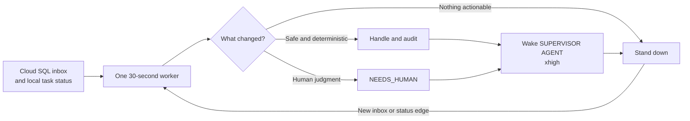

# Supervisor



This package provides two deliberately small pieces:

1. `supervisor` runs and monitors one interactive Codex or Claude process.
2. `supervisor scan-once` performs one explicit, read-only analysis of Codex
   tasks that are both idle and marked unread.

## Supervisor skill MVP

For manually initiated autonomous work, invoke the repo-scoped skill from a
Codex task:

```text
$supervisor Own this task through implementation and verification.
```

The skill creates or continues an explicit Codex goal and drives it through
verified completion. It is intentionally instruction-only and cannot wake a
machine, poll the shared inbox, or create a separate Codex task from an
external message. Those transport and recovery concerns remain owned by the
supervisor runtime.

The unread-task analysis remains read-only. Separately, the shared Cloud SQL
inbox can accept explicitly trusted v1 proposals into new mapped Codex
app-server tasks when recipient policy enables that mode.

## Install

Install both console commands for the current user:

```bash
./scripts/install-supervisor.sh
```

The installer adds an idempotent Zsh PATH/alias block and includes the
PostgreSQL client required by the repository shared-inbox skill. It does not
start or enable a service.

The shared workstation image separately bootstraps one durable Codex cockpit
by default. After the local app-server becomes available, it adopts the single
unarchived task titled `SUPERVISOR AGENT` or creates one with an explicit
workspace, writes its UUID to
`~/.config/codex-unread-supervisor/cockpit.env`, and starts the same foreground
worker described below. `bootstrap-cockpit` is idempotent and fails closed if
more than one matching task exists or a bound task has been renamed.

```bash
codex-unread-supervisor bootstrap-cockpit \
  --workspace "$HOME/supervisor-agent"
```

The workstation owner can select `SUPERVISOR_PROVIDER=claude` or `disabled` in
`~/.config/codex-unread-supervisor/startup.env`; the image launcher then leaves
Codex stopped so a user-owned Claude supervisor can replace it.

For development:

```bash
uv run --with pytest pytest -q
```

## Interactive controller

Start a provider in the current terminal:

```bash
supervisor codex
supervisor claude --task "Review the workspace and propose the next step"
```

The `supervisor` process is the controller. It owns the provider child, writes
a heartbeat, validates controller and provider process identities, and shuts
the provider process group down when stopped. The provider still uses the
current terminal; this release does not implement detach/reattach.

Use another terminal for lifecycle commands:

```bash
supervisor status
supervisor status --watch
supervisor status --json
supervisor logs SESSION_ID --follow
supervisor stop SESSION_ID
supervisor doctor
```

Codex sessions currently default to `gpt-5.6-sol` with `ultra` reasoning.
Session metadata and lifecycle logs are preserved under
`$XDG_STATE_HOME/codex-supervisor-manager`, or
`~/.local/state/codex-supervisor-manager` by default.

## One-shot unread analysis

Run the analysis explicitly:

```bash
supervisor scan-once
```

The installed workstation app-server does not currently expose the Codex
client's unread flag. Direct invocation therefore exits nonzero with an
`unread_supported: false` result instead of treating every idle task as unread.

When the command is launched from a Codex app workflow, pass a saved
`list_threads` response, which does include the authoritative client unread
state:

```bash
supervisor scan-once \
  --inventory-snapshot /tmp/codex-app-threads.json \
  --host-id remote-ssh-discovered:HOSTNAME
```

The snapshot must use Codex app schema version 2. Only entries matching the
selected host are considered; thread context is still read from that host's
app-server.

The selector fails closed. A task is analyzed only when the read-only Codex
inventory reports all of the following:

- the task is unarchived;
- `status.type` is `idle`;
- `hasUnreadTurn` is exactly `true`;
- `updatedAt` is a stable integer receipt; and
- no existing terminal human-review marker excludes it.

If the snapshot is absent and the configured inventory does not expose unread
state, or if required fields are missing or malformed, the command selects
nothing, does not invoke the decision provider, and exits nonzero.

For each eligible task, the command reads bounded context, asks the constrained
Claude/Fable session for either a proposed reply or a review recommendation,
and stores that result in the dry-run audit table. Context and classifier
errors are also recorded as dry-run review recommendations.

The command never:

- sends a reply;
- creates a delivery claim;
- clears unread state; or
- creates a terminal human-review marker.

Dry-run audit state remains outside the checkout at
`$XDG_STATE_HOME/demo-agent-supervisor/state.sqlite3`, or
`~/.local/state/demo-agent-supervisor/state.sqlite3` by default.

## Existing review and diagnostics tools

The lower-level command remains available for inspecting durable state:

```bash
codex-unread-supervisor status
codex-unread-supervisor human-review-queue
codex-unread-supervisor console
codex-unread-supervisor doctor --strict
```

The browser console is loopback-only and read-only at
`http://127.0.0.1:8765/`. Existing terminal human-review markers can be cleared
only with the explicit `reset-human-review` command. Its remote inbox section
keeps accepted tasks visible through picked-up, in-progress, handled, and
needs-review states, together with the handling agent identity.

The `serve` command is the single foreground scheduler. Every bounded tick
checks the local Codex app server and, when configured, the Cloud SQL inbox.
The inbox defaults to disabled. In `dry-run` mode it continuously observes
queued deliveries; in `poll` mode it handles at most one delivery per tick
after matching sender-verified canary evidence. With execution mode `trusted`,
an authorized v1 proposal is queued locally, starts one Codex app-server thread
and turn, and returns its result on the same Cloud SQL conversation. Systemd user units
rendered by `service-install` read the optional
`~/.config/codex-unread-supervisor/inbox.env` file and remain disabled until the
workstation startup/service owner enables them.

When `SUPERVISOR_COCKPIT_THREAD_ID` names the one unarchived task titled
`SUPERVISOR AGENT`, that same worker also sends edge-triggered, body-free status
updates to the task through the documented Codex app-server turn APIs. See the
operator guide for the fail-closed binding and audit details.
An idle or unloaded cockpit wakes at `xhigh` reasoning; an active cockpit is
never steered, and unchanged quiet polls leave it standing down.

## Safety boundary

Cloud inbox mutation remains gated by exact identity plus sender-verified
canary evidence. Autonomous Codex work additionally requires the trusted
contact grant, local execution mode, v1 payload, and recipient-owned workspace
mapping. Delivery IDs map to exactly one local run; ambiguous app-server
creation stops visibly rather than duplicating work. Results can resume only an
exact previously correlated existing task.

See [the specs index](specs/README.md) for the implementation split.
