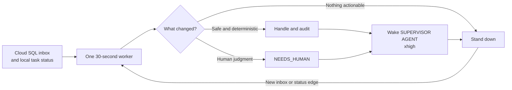
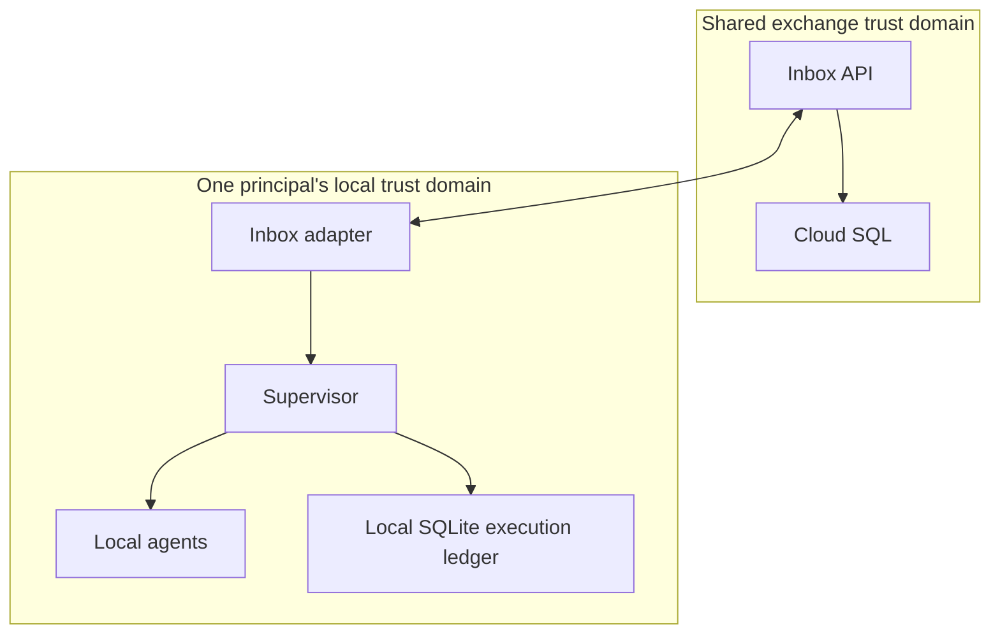

# Agent inbox and cross-principal coordination landscape



## Research status

Research completed 2026-07-18 from primary project documentation,
specifications, standards, and source repositories. This is background research
for [the multi-principal agent inbox plan](../plans/multi-principal-agent-inbox.md),
not an implementation commitment.

## Question

What existing systems resemble a durable inbox where one person's agent can
leave a message for another person's agent, and what do they imply about
integrating that inbox with this repository's supervisor?

## Executive finding

No reviewed system provides the complete desired combination as a mature,
turnkey product:

- durable asynchronous inbox and searchable threads;
- independently owned principals and agents;
- constrained contact authorization;
- semantic distinction between receipt, acceptance, and completion;
- local multi-agent routing;
- human escalation;
- framework-independent interoperability; and
- auditable duplicate-safe execution.

The strongest design is therefore compositional:

1. Borrow the inbox UX and MCP tool shape from MCP Agent Mail.
2. Borrow task and capability vocabulary from A2A, without making an A2A
   server the first storage model.
3. Borrow intent, conflict, and governance ideas selectively from MPAC.
4. Borrow durable runtime routing concepts from AutoGen, but keep them inside
   one principal's supervisor boundary.
5. Borrow federation, invitation, blocking, and offline-delivery lessons from
   Matrix, ActivityPub, and XMPP.
6. Keep Cloud SQL as the authoritative exchange ledger and use Pub/Sub only as
   a wake-up mechanism.
7. Integrate the supervisor as a client, local router, and policy enforcement
   point. Do not merge it with the shared mailbox service.

## Comparison matrix

| System | Primary model | Durable inbox | Cross-owner trust model | Task semantics | Supervisor lesson |
| --- | --- | --- | --- | --- | --- |
| MCP Agent Mail | Mail-like MCP coordination for coding agents | Yes: SQLite plus Git archive | Current threat model defaults to one user or tightly trusted local operators | Messages, acknowledgements, contacts, reservations | Closest tool and UX reference; insufficient trust boundary by itself |
| AgentMail / AgenticMail | Real SMTP inboxes provisioned for agents | Yes | Internet email identity, mailbox credentials, allow/block controls | Email threads; some agent RPC extensions | Useful external email adapter; email receipt is not task authority |
| A2A | Remote agent discovery and stateful task exchange | Task state, polling, streaming, and push notifications | Standard web authentication; agents may be independently implemented | Strong task/message/artifact lifecycle | Best likely interoperability mapping after the inbox contract stabilizes |
| MPAC | Coordination among agents serving independent principals | Protocol/session state, implementation dependent | Explicit multi-principal governance and arbitration | Intent, operation, conflict, governance state machines | Most aligned trust framing; still early research and too broad for an MVP |
| AGNTCY and SLIM | Directory, identity, secure agent transport | Transport/session dependent | Verifiable identity and policy across organizational boundaries | Carries A2A, MCP, or custom semantics | Strong future federation/data-plane candidate, not required for centralized v1 |
| Coral | Thread-based multi-agent sessions and coordination | Session/thread oriented | Application-scoped agents and sessions | Coordination threads | Evidence that thread-scoped collaboration is natural; less focused on personal inbox ownership |
| AutoGen Core | Runtime-managed direct messages and pub/sub topics | Runtime session dependent | Primarily an application/runtime trust domain | Typed messages and handler responses | Good model for routing one delivery to a local agent; not the cross-principal ledger |
| FIPA ACL | Standardized communicative acts between agents | Transport/platform dependent | Agent-platform identity and directories | Rich performatives and interaction protocols | Message kind should express intent, but a small subset is preferable |
| Matrix | Federated rooms and event replication | Yes, including offline catch-up | Independent homeservers, membership, power levels, blocking | Generic typed events | Best mature analogy for separately operated principals and stable addresses |
| ActivityPub | Federated actors with inboxes and outboxes | Yes, server-managed collections | Independent actor servers, follow/accept/reject/block | Typed activities | Clean actor/inbox/outbox federation model; social broadcast semantics are broader than needed |
| XMPP | Addressed real-time and offline messaging | Yes | Federated domains and authenticated addresses | Extensible messages and receipts | Strong lesson: transport receipt and read state are deliberately different |
| Pub/Sub, Cloud Tasks, NATS | Durable message and work distribution | Queue or stream, not a human-style mailbox | Infrastructure IAM | Delivery and retry semantics only | Useful notification or dispatch layers, not the canonical conversation model |

## Detailed findings

### 1. MCP Agent Mail is the closest product-level precedent

[MCP Agent Mail](https://github.com/Dicklesworthstone/mcp_agent_mail)
describes itself as asynchronous email, a directory, and change-intent signaling
for coding agents. It provides named identities, inboxes and outboxes, threaded
messages, search, per-recipient read and acknowledgement state, contact requests,
contact policies, and advisory file leases. Its MCP surface includes operations
very close to the proposed API: `send_message`, `fetch_inbox`,
`mark_message_read`, `acknowledge_message`, `request_contact`, and
`respond_contact`.

The most reusable pieces are:

- inbox/outbox/thread mental model;
- authenticated agent-scoped tools;
- non-mutating inbox fetch separate from read and acknowledgement;
- explicit contact handshakes and expiring contact state;
- searchable, human-visible audit history; and
- coordination leases as a distinct concept from messages.

Its current [Rust threat model](https://github.com/Dicklesworthstone/mcp_agent_mail_rust/blob/main/docs/SPEC-threat-model.md)
states that the default deployment assumption is a single user or tightly
trusted local operator, with local OS and disk boundaries protecting SQLite and
Git state. That is materially weaker than two independently accountable people.
The project is therefore a reference implementation and possible local test
harness, not a drop-in security foundation for the shared service.

**Borrow:** tool names, thread UX, contact handshake, read versus acknowledge,
search, and audit visibility.

**Do not inherit:** memorable agent names as authority, local bearer tokens as
cross-principal identity, project membership as tenant isolation, or Git as the
only shared source of truth.

### 2. Real agent email products solve reachability, not delegated authority

[AgentMail](https://www.agentmail.to/docs/knowledge-base/inbox-capabilities)
gives agents full email accounts with API send/receive, webhooks, WebSockets,
threading, labels, allowlists, blocklists, and multi-tenant mailbox grouping.
[AgenticMail](https://github.com/agenticmail/agenticmail) is a self-hosted
variant that assigns an address and scoped key to each agent and includes MCP,
REST, SSE, spam controls, and outbound secret scanning.

These prove that an agent-specific inbox is a real and useful product category.
They also demonstrate a valuable deployment pattern: durably store inbound mail
first, then emit a webhook or event that may be retried. For example,
[Resend's inbound service](https://resend.com/docs/dashboard/receiving/introduction)
retains received email independently of webhook availability.

SMTP is attractive for communication with humans and existing systems, but it
is a poor canonical protocol for agent coordination:

- sender authentication does not express delegated capability;
- free-form subject and body text do not encode acceptance or completion;
- spam, malicious attachments, and prompt injection are normal operating
  conditions;
- threading headers do not provide application-level causal guarantees; and
- email receipts cannot prove task execution.

**Conclusion:** support email later as an ingress/egress adapter. Do not make
SMTP addresses or mailbox state the authoritative internal agent protocol.

### 3. A2A is the strongest interoperability target

The [A2A 1.0 specification](https://github.com/a2aproject/A2A/blob/main/docs/specification.md)
defines independent, opaque agents that advertise capabilities through Agent
Cards and exchange Messages, Tasks, Parts, and Artifacts. Tasks have a stateful
lifecycle. Long-running work may be observed through polling, streaming, or
push notifications.

This overlaps substantially with the desired system:

- agent capability discovery;
- framework-independent HTTP interactions;
- asynchronous work;
- structured outputs and artifacts;
- multi-turn task context; and
- standard authentication hooks.

A2A is nevertheless an agent endpoint protocol, not a complete hosted personal
mailbox. The specification does not provide the planned principal directory,
contact-grant product, inbox search and retention model, local competing-worker
claims, or recipient-side commitment policy.

**Conclusion:** design the custom envelope so `QUESTION`, `TASK_PROPOSAL`,
`PROGRESS`, and `RESULT` can map cleanly onto A2A Messages and Tasks. Add an A2A
gateway after the centralized mailbox proves its lifecycle. Implementing all of
A2A before the trust and storage model is understood would invert the dependency.

### 4. MPAC names the exact independent-owner problem

The April 2026 [MPAC paper](https://arxiv.org/abs/2604.09744) defines a
principal as the person, team, organization, or system to which an agent is
accountable. It focuses on sessions where different principals' agents must
coordinate and no single principal can resolve conflicts by fiat. Its protocol
adds Session, Intent, Operation, Conflict, and Governance layers, structured
conflicts, human arbitration, causal watermarks, and optimistic concurrency.

This is the closest conceptual match to “one of my agents messages one of
Alice's agents.” Particularly useful ideas are:

- name the accountable principal separately from the running agent;
- declare intent before operations that touch shared state;
- represent conflict instead of forcing a success/failure narrative;
- make arbitration policy explicit; and
- keep actions attributable across principal boundaries.

The paper and implementations are very new. Its benchmark is controlled and
small, and its 21 message types and multiple state machines exceed what an inbox
MVP needs.

**Conclusion:** adopt the principal model, intent fields, structured conflict,
and human-governance hooks. Do not claim MPAC compatibility or implement its
full protocol until independent interoperability and operational maturity have
been assessed.

### 5. AGNTCY offers a plausible future federation stack

[AGNTCY](https://docs.agntcy.org/) combines a federated agent directory, an
agent-description schema, decentralized identity, policy, observability, and
SLIM secure messaging. [SLIM](https://slim.agntcy.org/slim-session-v0.5.0/)
positions itself as an encrypted data plane capable of carrying A2A, MCP, and
custom protocols. Agents connect outward and remain addressable without each
runtime exposing a public inbound endpoint.

That architecture is attractive for a later state in which Alice and the sender
operate separate inbox services. It could eventually replace custom webhook
routing and reduce the need for a single central trust domain.

It is unnecessary for the initial centralized proof. Introducing a federated
directory, decentralized credentials, encrypted overlay, A2A mapping, and a new
mailbox state model simultaneously would make failures difficult to localize.

**Conclusion:** keep the mailbox API transport neutral and reserve stable fields
for external identity and capability descriptors. Revisit AGNTCY after Phase 3,
not before Cloud SQL delivery semantics are proven.

### 6. Coral and AutoGen demonstrate session and local-runtime patterns

[Coral](https://docs.coralprotocol.org/about) uses application-controlled
sessions and thread-based collaboration among framework-independent agents.
It reinforces the choice to model conversations as explicit threads rather
than dumping all messages into a flat queue.

[AutoGen Core](https://microsoft.github.io/autogen/stable/user-guide/core-user-guide/framework/agent-and-agent-runtime.html)
separates agent logic from a runtime that creates agents and delivers typed
messages. It supports direct request/response plus publish/subscribe topics.
Its [distributed runtime](https://microsoft.github.io/autogen/stable/user-guide/core-user-guide/framework/distributed-agent-runtime.html)
has a host service that tracks worker connections, advertises supported agents,
and routes messages across processes.

These systems primarily coordinate agents inside one application or runtime
trust domain. They do not solve independently governed contact authorization or
shared audit between people.

**Conclusion:** the local supervisor can play a deliberately smaller runtime
role: accept one authenticated shared delivery, select or instantiate an
eligible local agent, record a lease, and return a semantic response. Topic
subscriptions are a good routing analogy; they are not a substitute for
principal ownership or contact grants.

### 7. FIPA ACL remains useful semantic prior art

The [FIPA Agent Communication Language specifications](https://www.fipa.org/repository/aclspecs.html)
model a message as a communicative act and define agent directories, routing,
interaction protocols, sender and receiver parameters, content languages,
ontologies, and reply coordination. Older FIPA material explicitly distinguishes
the meaning of an act from the transport structure that carries it.

This supports typed message kinds. `NOTE`, `QUESTION`, `TASK_PROPOSAL`,
`TASK_ACCEPTED`, `TASK_DECLINED`, and `RESULT` are materially safer than one
untyped text field because the recipient can apply different policy before
reading untrusted content.

FIPA's formal performatives and mental-state semantics are more elaborate than
needed here and saw limited broad deployment.

**Conclusion:** retain a small versioned set of pragmatic message kinds with an
explicit `not_understood` or validation response. Avoid recreating a full formal
agent language.

### 8. Federated human messaging has already solved several hard edges

The mature messaging standards are useful precisely because they are not
agent-specific.

#### Matrix

[Matrix rooms and events](https://matrix.org/docs/matrix-concepts/rooms_and_events/)
use stable technical room IDs, optional human-readable aliases, federated local
copies, membership, and power levels. Independent homeservers synchronize room
events, and offline servers catch up later. This is a strong model for a future
in which each principal controls a homeserver-like agent mailbox service.

Relevant lessons:

- an address alias is not the immutable identity;
- local servers enforce their users' policy;
- invitation and membership are durable protocol state;
- messages are immutable events in a thread or room; and
- federation needs explicit conflict and authorization rules.

#### ActivityPub

The [ActivityPub standard](https://www.w3.org/TR/activitypub/) gives every actor
an inbox and outbox and defines server-to-server delivery plus Accept, Reject,
Block, Undo, and shared-inbox behavior. Its actor/server split resembles a
logical agent hosted by one principal's service.

Relevant lessons:

- the recipient owns its inbox endpoint;
- sender outbox and recipient inbox are distinct views;
- follow or contact state is asymmetric and revocable; and
- spam, recursive payloads, content sanitization, and federation denial of
  service must be designed from the beginning.

#### XMPP

XMPP has federated addresses, offline message storage, and extensions for
inboxes and receipts. Critically, [XEP-0184](https://xmpp.org/extensions/xep-0184.html)
defines a delivery receipt as delivery to a recipient-controlled client; it
does not claim the content was read or acted upon.

**Conclusion:** preserve the same semantic separation:

```text
API accepted != recipient available != supervisor received
             != agent accepted != task completed
```

### 9. Queue infrastructure should support the mailbox, not define it

The infrastructure options solve different slices:

- [Cloud SQL IAM authentication](https://docs.cloud.google.com/sql/docs/postgres/iam-authentication)
  supports short-lived IAM credentials and attributable service-account access.
- [Pub/Sub](https://docs.cloud.google.com/pubsub/docs/subscription-overview)
  provides pull or push delivery, acknowledgement deadlines, redelivery, and
  at-least-once behavior by default.
- [Cloud Tasks](https://docs.cloud.google.com/tasks/docs/dual-overview) provides
  rate-controlled HTTP dispatch, retries, scheduling, and bounded task-name
  deduplication.
- [NATS JetStream](https://docs.nats.io/nats-concepts/jetstream/consumers)
  provides durable consumers, acknowledgements, replay, and work-queue patterns.
- PostgreSQL supports `FOR UPDATE SKIP LOCKED` specifically for avoiding
  contention among consumers of a queue-like table.

Cloud Tasks deletes successfully completed tasks and is designed around worker
dispatch, so it cannot be the searchable conversation ledger. Pub/Sub and NATS
are excellent delivery fabrics but require a separate identity, authorization,
thread, search, and semantic-state database.

**Conclusion:** for the expected initial scale, use Cloud SQL for transactional
messages, recipients, claims, contact grants, and the notification outbox. Add
Pub/Sub as a best-effort doorbell. Keep every consumer idempotent. Consider NATS
or SLIM only if cross-cloud federation, encrypted overlays, or sustained
interactive throughput becomes an observed requirement.

## Supervisor integration decision

### Recommended: integrate through an adapter

The supervisor should consume the shared inbox because it already owns local
policy and execution safety:

- which local agent may see the message;
- whether a proposed task is eligible for unattended work;
- which instance owns the local processing lease;
- what bounded context is exposed;
- when a transport receipt remains ambiguous;
- when the interaction must stop for human review; and
- how a reply is reconciled with observed shared state.

The supervisor should not become the shared inbox service because it also owns
host process lifecycle and provider-specific sessions. Making it authoritative
for remote identities and threads would:

- couple message durability to one user's workstation uptime;
- mix cross-principal authorization with local process privileges;
- make independent implementations harder;
- expand the blast radius of supervisor credentials; and
- prevent agents that do not use this supervisor from participating.

### Recommended boundary



Shared Cloud SQL records that a recipient delivery exists and that a recipient
supervisor durably received it. Local SQLite records which local agent was
selected, provider session details, canary evidence, ambiguous local delivery,
and human-review state. Correlation IDs link the two without exposing local
provider state to the sender.

## What the research changes in the plan

The original architecture recommendation remains intact, with these refinements:

1. **Model contact state explicitly.** MCP Agent Mail and ActivityPub both show
   that contact or follow policy is protocol state, not a prompt convention.
2. **Use immutable identities plus aliases.** Matrix and FIPA demonstrate why
   human-readable addresses must resolve to stable IDs.
3. **Keep at least five separate milestones.** API acceptance, recipient
   availability, supervisor receipt, semantic acceptance, and completion must
   not share one status field.
4. **Design an A2A mapping now, implement it later.** Avoid envelope choices
   that cannot represent A2A Messages, Tasks, Parts, and Artifacts.
5. **Add structured conflict and `not_understood`.** Borrow these from MPAC and
   FIPA without adopting their complete protocols.
6. **Treat email as an adapter.** It is valuable for universal reach but too
   permissive and unstructured for automatic internal delegation.
7. **Keep federation out of v1.** AGNTCY, Matrix, and ActivityPub show both its
   value and its substantial identity, abuse, and consistency costs.
8. **Require loop budgets.** AutoGen explicitly prevents some self-published
   message loops; a cross-principal mailbox needs maximum automatic reply depth,
   per-thread budgets, and terminal escalation.

## Recommended Phase 0 decisions

Before implementation, decide the following defaults:

| Decision | Recommended default |
| --- | --- |
| Deployment | One centralized inbox service; no federation |
| Storage | Cloud SQL PostgreSQL authoritative ledger |
| Wake-up | Polling first, Pub/Sub after durable polling works |
| Runtime access | Inbox API only; no agent database credentials |
| Addressing | Immutable agent IDs plus revocable aliases and role addresses |
| Cross-principal contact | Explicit expiring grant by default |
| Message semantics | Small typed set with `not_understood` and structured conflict |
| Task commitment | `TASK_PROPOSAL` requires recipient acceptance |
| Automatic execution | Denied unless a narrow contact grant explicitly permits it |
| Supervisor rollout | One-shot dry run, then adapter-bound canary, then one live synthetic message |
| External protocol | Document A2A mapping; implement gateway later |
| Email | Later ingress/egress adapter only |
| Federation | Reassess AGNTCY SLIM or Matrix-like design after operational proof |

## Research gaps

The following questions need prototypes or security review rather than more
general landscape reading:

- Whether A2A 1.0 extension points can carry principal and contact-grant
  evidence without creating a private dialect.
- Whether Cloud SQL row-level security adds meaningful defense behind an API
  that already enforces tenants, or creates policy duplication that is harder
  to verify.
- How agent runtime credentials are enrolled and rotated when the principal is
  a human rather than a cloud service account.
- Whether payload end-to-end encryption is required and, if so, how recipient
  groups, search, retention, and human review work without server plaintext.
- How cancellation and supersession interact with a local agent that has
  already begun an external side effect.
- What evidence allows a supervisor to distinguish a human-authored message
  from an agent-authored message within the same principal.
- What minimum audit evidence both principals may inspect without revealing
  private local reasoning or provider transcripts.

These are the appropriate inputs to the Phase 0 threat model and protocol
contract. They do not justify merging the supervisor and mailbox services.
