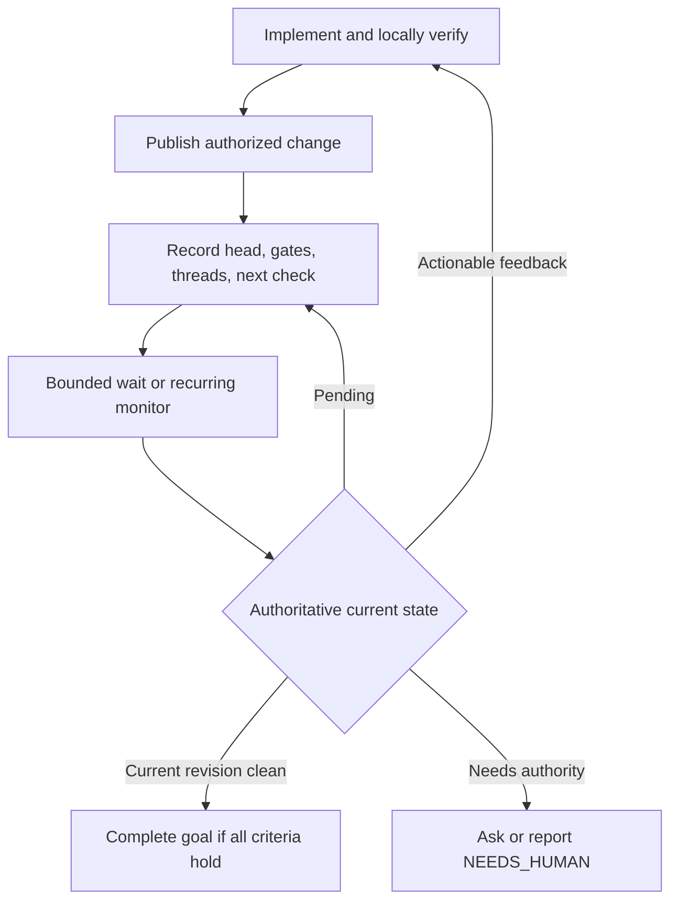

# Goal Mode interim: make active tasks reliable before the runner exists

## Decision

Improve `supervisor-skill-mode` now around work that an already-active Codex
task can safely own: explicit completion contracts, durable progress state,
bounded waits, and strict verification of asynchronous gates. Do not imitate a
daemon in a skill. The skill must remain instruction-only and must not poll
inboxes, create unrelated tasks, or claim restart-safe delivery.

The runner design in [runner control plane](runner-control-plane-design.md)
later supplies wake-up and durable correlation. These improvements make that
handoff clean instead of compensating for a weak task lifecycle.

## Goal contract

At activation, turn the request into one outcome with observable completion
criteria. The task should retain these fields in its goal or execution plan:

| Field | Purpose |
|---|---|
| Outcome | The user-visible result to produce |
| Authority | What may be changed, published, deployed, or merged |
| Evidence | Tests, checks, review state, measurements, or delivery proof |
| Pending gates | External dependency, current revision, and next verification action |
| Resume point | The next safe action after a wake-up or interruption |

This is execution state, not a second project-management system. Keep it short
and update it only when the next action or completion evidence changes.

## Asynchronous-gate loop

For CI, review, deployment, or another genuinely external gate, Goal Mode uses
the same disciplined loop:

Rules:

- Treat queued or pending checks as pending, never as passing.
- Read review threads with their resolution state; a flat comment list is not
  enough.
- After material changes, request/reconcile review on the current head commit.
- Do not merge, close, or resolve uncertain feedback without the user’s
  authority and evidence that it was actually addressed.
- Before waiting, record the head SHA, gate URLs/identifiers where available,
  unresolved thread identifiers, and the exact next check.
- After interruption, reread authoritative state. Do not assume a prior poll,
  push, or review request succeeded.

Use product-provided bounded waits or recurring monitors when available. A
short expected wait can recheck roughly every 30–60 seconds; back off to a few
minutes for a long external wait. Never tight-poll or burn model turns merely
to keep a task alive.

## Interim completion protocol

Before completing a goal, compare the actual state to its original contract:

1. Required implementation and local verification are complete.
2. Authorized publishing/deployment succeeded, if in scope.
3. Required CI/checks apply to the current revision and pass.
4. No actionable unresolved review thread remains.
5. Any expected external output has been observed, or is explicitly identified
   as outside the user's authorized scope.

If waiting remains meaningful, preserve the goal and wait. If the same genuine
external blocker prevents progress for the required consecutive turns, mark it
blocked with the missing authority or event. Never use a low token budget, a
partial diff, or a stale approval as a completion reason.

## Small, high-leverage skill changes

The current PR feedback loop is the first implementation. Add these next, in
order:

1. **Completion-contract template.** Require outcome, evidence, authority, and
   pending gates when creating a goal whose work has external effects.
2. **Resume checkpoint.** Before any bounded wait, capture the next
   authoritative query and identifiers needed to run it.
3. **External-result intake.** When the user posts CI/review/result text, treat
   it as steering or evidence; verify it against the source when possible and
   map it to a pending gate rather than treating it as automatically decisive.
4. **Explicit task outcome.** Encourage runner-owned tasks to end with a
   concise `RESULT` or `NEEDS_HUMAN` summary, including verification evidence.
   This is a prompt convention now; the runner later transports it.

Avoid adding scheduling syntax, inbox credentials, job queues, retry counters,
or cross-task addressing to the skill. Those would be unverifiable copies of
runner responsibilities.

## Acceptance tests

- A goal with a PR cannot complete while required checks are queued or apply to
  an older head.
- A material fix causes a fresh-review/reverification cycle.
- An interruption followed by resumption rereads current state rather than
  relying on cached claims.
- A non-PR goal remains lightweight; it does not require irrelevant gate state.
- The skill never creates a background service, polls an inbox, or starts an
  unrelated task.

## Migration into the runner

The runner should pass a normalized launch contract and wake hints; it should
not replace Goal Mode's completion protocol. In return, Goal Mode produces a
bounded outcome and preserves a useful resume point. This creates a clean
boundary: the runner makes sure the right task is alive at the right time, and
the skill makes sure that task does the right work before it says it is done.
