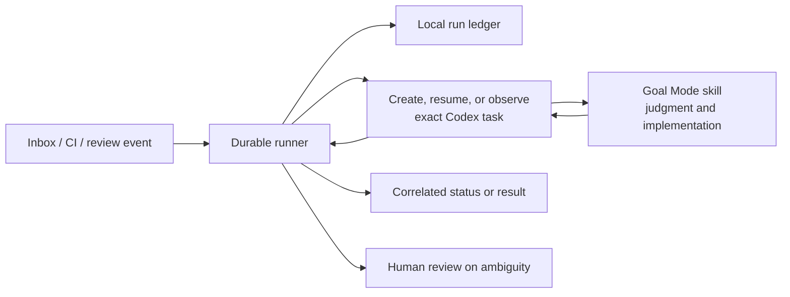
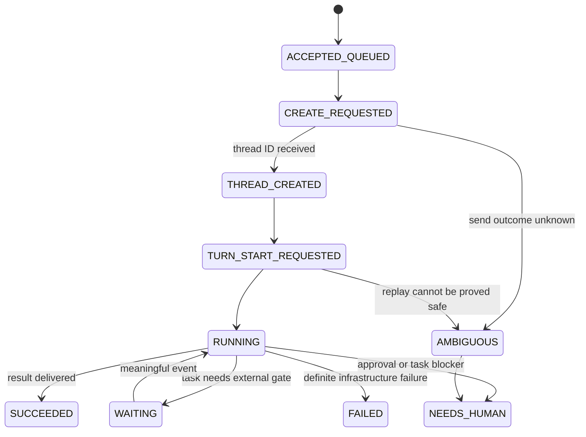

# Runner control plane: durable coordination, not a second agent

## Decision

Build one small, durable runner that owns **event transport and task
coordination**, while a Codex task in `supervisor-skill-mode` owns **reasoning
and execution**. The runner is a bounded state machine, not a general-purpose
agent, prompt loop, or competing task manager.

This adds value only where Goal Mode cannot: waking on external events,
surviving restarts, safely reconciling ambiguous remote calls, and delivering a
result to the exact originating task.



## Problem and non-goals

An active Goal Mode task can wait for CI or a review, but it cannot guarantee
that it will be woken after an app restart, accept a trusted inbox proposal,
or make a distributed side effect exactly once. A naive script that repeatedly
prompts a "supervisor" also creates duplicate work, loses correlation, and
makes authorization hard to audit.

The runner will not:

- decide implementation, product, security, or review questions;
- interpret arbitrary inbox text as permission to run code;
- select a model, sandbox, workspace path, approval policy, or credentials on
  a sender's behalf;
- steer an active Codex task by default; or
- declare a goal complete from a timer, a stale check, or an empty queue.

## Value proposition

| Capability | Why it belongs in the runner | Why it does not belong in the skill |
|---|---|---|
| Event wake-up | A service can poll or subscribe while no task is loaded | An instruction file cannot run by itself |
| Exact-once-ish dispatch | A ledger and idempotency keys survive process restarts | Prompt context is not a transaction log |
| Capacity and fairness | Enforce global/per-workspace limits consistently | Individual tasks cannot see the whole queue safely |
| Result correlation | Resume only the verified source task | A new task must never guess a recipient |
| Failure visibility | Surface `AMBIGUOUS` and `NEEDS_HUMAN` durably | Retrying a possibly sent request risks duplicate work |
| Cheap observation | Polling is lower cost than keeping reasoning active | Goal Mode should spend reasoning only on meaningful work |

## Operating model

One foreground worker owns one process lease and one cadence. Each tick is
bounded, independently isolates failing sources, and performs this order:

```text
receive and route events
  -> reconcile uncertain side effects
  -> dispatch queued runs within capacity
  -> observe exact owned tasks
  -> deliver terminal results to exact correlated source tasks
  -> publish body-free status edges
```

The initial source should be the existing trusted Cloud SQL inbox. CI and PR
events may be added later through the same normalized event interface, rather
than through a second polling daemon.

### Task launch contract

Only a locally authorized event may launch work. The runner resolves the
workspace from a recipient-owned allowlist, persists the run before calling
Codex, and starts a new task with a locally generated wrapper:

```text
You are executing a runner-owned task.
Source: <bounded, authenticated provenance>
Required outcome: <bounded task request>
Completion contract: report verification or NEEDS_HUMAN.
Invoke $supervisor-skill-mode and own this outcome through completion.
```

The external body is data, not instructions with authority. It is never copied
into operational logs, heartbeats, or cockpit updates.

### Result contract

The runner owns delivery, not interpretation. A terminal task result becomes
one of:

- `RESULT`: a bounded final response and verification summary;
- `NEEDS_HUMAN`: approval, ambiguity, or a task-declared blocker;
- `FAILED`: an infrastructure failure with a safe diagnostic class.

`RESULT` and `NEEDS_HUMAN` may resume only a source task whose local thread ID
was recorded at proposal time. If it is active, delivery waits. If the mapping
is missing or cannot be verified, the event goes to human review.

## Durable state and failure rules

The local ledger is the source of truth for runner effects. It records the
event/delivery ID, locally resolved workspace key, status, Codex thread and
turn IDs, deterministic client message ID, outbound correlation, timestamps,
and sanitized error classification. It stores an execution body only until
the first turn is durably reconciled, then retains only a hash and metadata.

Suggested state machine:



Every transition is committed before its external side effect. When the
app-server call outcome is unknown, do not issue a second creation request.
Mark `AMBIGUOUS`, preserve evidence, and require a human to reconcile it.
This deliberately prefers one visible orphan over duplicated autonomous work.

## Interfaces

Keep the core runner independent of transport and Codex protocol details.

```text
EventSource.poll() -> [AuthorizedEvent]
RunStore.transition(run_id, expected_state, new_state) -> Run
TaskGateway.start(workspace, prompt, client_message_id) -> ThreadAndTurn
TaskGateway.read(thread_id) -> TaskObservation
ResultSink.publish(correlation, outcome, idempotency_key) -> Receipt
```

Adapters own Cloud SQL, app-server schemas, CI webhooks, and service startup.
The core owns policy evaluation, state transitions, capacity, and reconciliation.

## Delivery phases and exit criteria

1. **Ledger and observation.** Add typed run records, worker lease, bounded
   status projection, and tests for restart/reconciliation. No task creation.
2. **Trusted inbox dispatch.** Admit only v1 requests that pass local policy;
   create one mapped task and use the Goal Mode launch contract. Prove duplicate
   delivery and restart behavior.
3. **Completion correlation.** Monitor mapped tasks and send idempotent result
   or `NEEDS_HUMAN` messages to the exact origin. Prove an active origin is
   never steered.
4. **External gates.** Normalize CI/review events into wake hints. They can wake
   the owning task but never mark its goal clean; the skill verifies current
   head/check/review state.

Ship a phase only when its state transitions, retries, and ambiguity cases have
deterministic tests. Leave service enablement opt-in and fail closed by default.

## Measures of success

- No duplicate Codex task from a duplicate or retried delivery.
- No result delivered to an uncorrelated task.
- A process restart resumes observation and reconciliation from the ledger.
- Quiet polling performs no model invocation and sends no cockpit turn.
- Every autonomous launch has an auditable local authorization decision.
- Goal Mode, not the runner, remains responsible for implementation quality and
  declaring completion.
