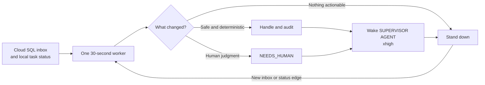

# Supervisor shared inbox operator guide



The shared inbox is an optional, fail-closed PostgreSQL adapter. The existing
`codex-unread-supervisor serve` scheduler polls the local Codex app server and
Cloud SQL in the same tick. In `review` execution mode it never invokes Codex
for task proposals. In explicitly configured `trusted` mode, a v1 task from a
contact grant that permits unattended execution becomes a mapped Codex
app-server thread and turn.

Install the optional client dependency with `pip install -e '.[inbox]'` and
point the DSN at a Cloud SQL Auth Proxy port or socket. Do not put credentials
in this repository or in the SQLite state database.

```sh
export SUPERVISOR_INBOX_MODE=dry-run
export SUPERVISOR_INBOX_DSN='postgresql://...'
export SUPERVISOR_INBOX_INSTANCE_ID='stable-workstation-instance'
export SUPERVISOR_INBOX_AGENT_ID='00000000-0000-0000-0000-000000000000'
export SUPERVISOR_INBOX_EXECUTION_MODE=review
export SUPERVISOR_INBOX_WORKSPACE_KEY=supervisor-agent
export SUPERVISOR_INBOX_WORKSPACE=/absolute/path/to/supervisor-agent
```

`SUPERVISOR_INBOX_SCHEMA` defaults to `public`. Poll seconds must be 5–300 and
claim seconds 5–900. The inbox defaults to `disabled`; interactive manager and
manual local scan commands do not connect to PostgreSQL.

## Continuous combined worker

Copy `config/inbox.env.example` to
`~/.config/codex-unread-supervisor/inbox.env`, fill in one real user's exact
email and immutable agent UUID, and set mode `0600`. The generated systemd user
service reads this file without placing the DSN in its unit. The DSN must point
to a keyless IAM-authenticated Cloud SQL Auth Proxy owned by that same user.

Run the foreground worker directly for inspection:

```bash
set -a
. ~/.config/codex-unread-supervisor/inbox.env
set +a
codex-unread-supervisor serve --interval 30
```

`SUPERVISOR_INBOX_POLL_SECONDS` and `serve --interval` must match so there is
one cadence rather than two competing schedulers.

Each tick lists queued deliveries and records body-free, deduplicated routing
observations. `dry-run` mode only observes. `poll` mode additionally claims and
handles at most one delivery per tick, but only while the configured real-user
identity has matching sender-verified canary evidence. Without that evidence,
the worker stays alive, continues observing, and publishes a degraded heartbeat
that names the gate. It never silently upgrades observation into mutation.

The worker holds one process-lifetime lease. A second scheduler refuses to
start. Expected app-server or database failures are isolated per source and the
next tick retries; heartbeat details contain only bounded projections and error
types, never DSNs or message bodies.

## Trusted Codex execution

Set `SUPERVISOR_INBOX_EXECUTION_MODE=trusted` only with an existing absolute
recipient-owned workspace path. Automatic acceptance additionally requires the
existing inbox canary, a Cloud SQL contact grant with
`allow_unattended_execution=true`, and a valid `shared-inbox-task/v1` proposal
whose logical `workspace_key` matches local configuration. Senders cannot
select a filesystem path, model, sandbox, approval policy, or credentials.

The worker persists the accepted job before calling app-server, sends
`TASK_ACCEPTED` in the same Cloud SQL conversation, then calls `thread/start`
and `turn/start`. It monitors the exact recorded thread without relying on the
unavailable unread flag and sends `RESULT` or `NEEDS_HUMAN` on completion.
Capacity limits queue accepted work; there is no conversation hop limit.

`thread/start` has no documented client idempotency key. If its transport
outcome is unknown, the run becomes visible `AMBIGUOUS` state and the worker
does not create another thread. A known thread ID may safely continue to its
first turn after restart. Temporary task bodies are removed from SQLite after
the turn is durably started and never enter heartbeat or cockpit output.

When the sending skill runs inside Codex, it records `CODEX_THREAD_ID` with the
outbound Cloud SQL thread. Returned terminal messages resume that exact existing
task when idle or unloaded; active tasks defer delivery, and missing mappings
never cause a guessed or new session.

## Durable Codex cockpit bridge

The workstation default is one durable Codex cockpit per user. The image
launcher runs `bootstrap-cockpit` after the local app-server is reachable. The
command adopts exactly one existing unarchived `SUPERVISOR AGENT` task or
creates, names, initializes, and atomically binds one new task. It persists only
the task UUID in `~/.config/codex-unread-supervisor/cockpit.env`; retries recover
a partially created bound task instead of creating a duplicate.

To replace the default with Claude, set `SUPERVISOR_PROVIDER=claude` in
`~/.config/codex-unread-supervisor/startup.env`, stop the image-owned worker,
and launch the user-owned Claude supervisor. The next boot honors the provider
selection and does not recreate a Codex cockpit.

Set `SUPERVISOR_COCKPIT_THREAD_ID` in the same mode-`0600` environment file to
the UUID of the one durable Codex task titled exactly `SUPERVISOR AGENT`. The
existing combined worker then publishes an update only when its allowlisted
status projection changes. It does not start another scheduler.

The bridge uses the documented local app-server protocol. It verifies that the
configured UUID identifies exactly one unarchived task with the expected title,
then uses `thread/resume` plus `turn/start` with `xhigh` reasoning for an idle or
unloaded task. An active cockpit is never steered or interrupted; the newest
status edge remains pending until the cockpit becomes dormant. A deterministic
`clientUserMessageId` and the local SQLite audit table make retries idempotent
and visible. A title mismatch, missing/archived task, unknown task state, or
app-server error fails closed and records only the exception type.

The worker remains the cheap, durable wake listener. When no actionable local
task is established and the Cloud SQL inbox is empty, the cockpit finishes its
turn and stands down as a dormant task. A later status edge, including new Cloud
SQL inbox work, starts a new cockpit turn; unchanged 30-second polls do not.

Cockpit prompts are explicitly labeled as automated and contain only bounded
health flags, counts, deterministic route totals, human-review totals, canary
state, and mutation blockers. They never contain inbox subjects, bodies,
message/delivery/thread IDs, sender names, or credentials. Heartbeat data adds
only whether delivery succeeded and which documented turn method was used.

Inspect the local audit without contacting Codex or Cloud SQL:

```bash
python - <<'PY'
from codex_supervisor.state import SupervisorState, default_state_path
state = SupervisorState(default_state_path())
try:
    print(state.cockpit_status())
finally:
    state.close()
PY
```

Use `supervisor inbox status` for local status. It masks the connection target
and does not connect unless `--check-connection` is supplied. Use
`supervisor inbox scan-once` for a read-only stored-function listing and local,
body-free routing observations.

## Synthetic canary and one-shot handling

Live commands require `SUPERVISOR_INBOX_MODE=one-shot` and an immutable agent
UUID. The synthetic canary must be the single oldest queued delivery, be a
`QUESTION`, and contain `{"supervisor_canary": true}` in `body_json`.

The separately authenticated sender queues that fixed payload through the
stored-function adapter; no raw SQL is required:

```sh
supervisor inbox send-canary \
  --recipient-address RECIPIENT_GOOGLE_EMAIL \
  --idempotency-key operator-canary:UNIQUE_STABLE_LABEL
```

Pause the recipient's continuous worker before the explicit claim so the
manual canary command can hold the single-worker lease.

```sh
supervisor inbox canary --delivery-id DELIVERY_UUID
```

The first invocation claims exactly that expected delivery, sends a bounded
non-LLM `RESULT`, completes it, and prints the reply message UUID. It does not
enroll canary evidence yet. Verify through the sender's separately
authenticated smoke harness that exactly one reply exists in the original
thread, then bind that observation:

```sh
supervisor inbox canary --delivery-id DELIVERY_UUID \
  --sender-observed-reply-id REPLY_MESSAGE_UUID
```

Only matching contract, adapter, database session identity, local instance,
and handler evidence enables `supervisor inbox run-once`. Run-once claims at
most one delivery. A proposal goes to human review unless every trusted-mode
gate above passes. Any uncertain acknowledgement, send, completion, recipient,
or delivery identity becomes terminal `AMBIGUOUS` local state and is never
retried automatically.

The PostgreSQL client calls only `inbox_list_deliveries`,
`inbox_claim_next_delivery`, `inbox_mark_received`,
`inbox_complete_delivery`, and `inbox_send_message` in the configured schema.
It performs no raw mailbox table DML.

## Sending a task between workstations

Use the repository skill at
`.agents/skills/send-shared-inbox-task/SKILL.md`. The two runtime principals are
the actual Google users `alice@gravitationalventures.com` and
`frank@gravitationalventures.com`; the retired synthetic Alice/Bob service
accounts are not valid deployment identities. Agent addresses and UUIDs remain
fixed v0 deployment outputs: Alice is
`alice@gravitationalventures.com` / `7a3fa6fa-2f49-42c9-bb6a-d4a9eafed720`
and Frank is `frank@gravitationalventures.com` /
`fa212e75-7581-457b-a918-4ac8bc617bbc`. The same email is the agent address and
authenticated PostgreSQL `session_user`; no other address aliases are accepted.
The resolver rejects unknown, stale, partial, or self mappings and submits only
an idempotent `TASK_PROPOSAL` through `inbox_send_message`.

```bash
uv run python .agents/skills/send-shared-inbox-task/scripts/send_task.py \
  --to alice@gravitationalventures.com \
  --subject "Investigate the import" --body-file /tmp/task.txt
```

A successful send means queued, not accepted. A trusted recipient reports
acceptance with a separate `TASK_ACCEPTED`, then later returns `RESULT` or
`NEEDS_HUMAN`. The skill emits v1, preserves the source Codex thread
correlation, and never treats the initial queue receipt as proof of execution.
