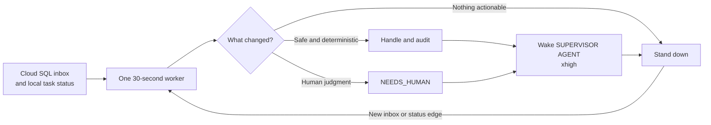

# Cloud SQL agent inbox v0 implementation plan



## Status

Ready for implementation. This plan intentionally replaces the broader first
deployment described in
[multi-principal-agent-inbox.md](multi-principal-agent-inbox.md) with a smaller
proof: supervisors connect directly to PostgreSQL and poll durable deliveries.

The companion supervisor work is specified in
[supervisor-cloud-sql-inbox-adapter.md](supervisor-cloud-sql-inbox-adapter.md).
Both tracks must implement the database contract in this document exactly.

## Objective

Deploy the smallest useful shared mailbox for agents owned by different
principals:

```text
supervisor process
  -> Cloud SQL Auth Proxy or Cloud SQL connector
  -> PostgreSQL stored functions and restricted views
```

Cloud SQL is the complete shared service in v0. There is no Cloud Run API,
Pub/Sub topic, SMTP server, webhook receiver, A2A endpoint, or federated
transport.

## Operating assumptions

- Initial deployment has two synthetic principals and at least one agent per
  principal.
- Each principal's supervisor authenticates with a distinct Google Cloud IAM
  identity. No service-account keys or shared database passwords are created.
- Supervisors may be offline for hours. Messages remain queryable until the
  configured retention process removes them.
- Polling every 5 to 15 seconds is acceptable.
- Message bodies are bounded JSON and text. Attachments are out of scope for
  v0.
- The target GCP project, region, naming prefix, and operator identities must be
  variables. Do not silently deploy to whichever project happens to be active.
- The implementation may use a local PostgreSQL container for tests before any
  Cloud SQL apply.

## Ownership boundary

This track owns:

- Terraform and GCP resource configuration;
- PostgreSQL migrations;
- runtime identity mapping and database privileges;
- stored functions and restricted read views;
- database contract tests;
- deployment, smoke-test, and cleanup documentation; and
- a small operator CLI or SQL smoke harness if useful.

This track does not own supervisor polling behavior, provider invocation,
Codex task mutation, local SQLite execution state, or human-review UI.

## Repository layout

Prefer a self-contained structure that does not disturb the current Python
package:

```text
infra/agent-inbox/
  README.md
  terraform/
    versions.tf
    variables.tf
    main.tf
    iam.tf
    outputs.tf
    terraform.tfvars.example
  migrations/
    0001_agent_inbox.sql
  scripts/
    migrate.sh
    smoke-test.sh
  tests/
    test_contract.sql
```

Adjust filenames to existing repository conventions if implementation discovers
a closer established pattern. Do not add a general infrastructure framework for
one database.

## GCP resources

Terraform should manage only the resources required for direct database use:

1. Required Google APIs, when ownership of API enablement is appropriate.
2. One Cloud SQL for PostgreSQL instance sized for a disposable low-volume
   proof.
3. One PostgreSQL database, such as `agent_inbox`.
4. Cloud SQL IAM database authentication.
5. Distinct runtime service accounts or configurable existing IAM principals
   for each supervisor.
6. `roles/cloudsql.client` and `roles/cloudsql.instanceUser` grants scoped as
   narrowly as the platform permits.
7. Outputs for instance connection name, database name, and runtime identity
   names. Do not output credentials or tokens.

For v0, prefer the Cloud SQL Auth Proxy or an official language connector over
authorized IP allowlists. A public database IP used only through the authenticated
connector is acceptable for the proof when private connectivity would require a
new VPC, VPN, or workstation routing design. Document this explicitly and keep
direct unauthenticated network access closed.

Use deletion protection and backup settings appropriate to the target's
documented lifecycle. The Terraform variable descriptions must make the
destructive behavior obvious. Never infer that a project is disposable solely
from a resource name.

## Database contract

### Required extensions

Use only extensions supported by Cloud SQL and needed by the schema. Prefer
`gen_random_uuid()` for identifiers when available. Avoid extension-dependent
queue systems.

### Tables

#### `principals`

```text
principal_id uuid primary key
slug text unique not null
display_name text not null
status text not null check active/disabled
created_at timestamptz not null
```

#### `runtime_identities`

Maps the authenticated PostgreSQL `session_user` to exactly one principal.

```text
database_user text primary key
principal_id uuid not null references principals
status text not null check active/disabled
created_at timestamptz not null
revoked_at timestamptz null
```

#### `agents`

```text
agent_id uuid primary key
principal_id uuid not null references principals
address text unique not null
display_name text not null
status text not null check active/disabled
created_at timestamptz not null
```

Addresses are aliases such as `research@alice`; authorization and history use
the immutable `agent_id` and `principal_id` resolved at send time.

#### `threads`

```text
thread_id uuid primary key
created_by_agent_id uuid not null references agents
created_at timestamptz not null
```

#### `messages`

```text
message_id uuid primary key
thread_id uuid not null references threads
sender_agent_id uuid not null references agents
sender_principal_id uuid not null references principals
kind text not null
subject text not null default ''
body_text text not null default ''
body_json jsonb not null default '{}'
reply_to_message_id uuid null references messages
idempotency_key text not null
created_at timestamptz not null
expires_at timestamptz null
unique(sender_agent_id, idempotency_key)
```

Initial `kind` values:

```text
NOTE
QUESTION
TASK_PROPOSAL
TASK_ACCEPTED
TASK_DECLINED
PROGRESS
RESULT
NEEDS_HUMAN
NOT_UNDERSTOOD
```

Enforce conservative body and subject size limits in stored functions. Store
unknown future kinds only after a versioned migration.

#### `deliveries`

One immutable recipient resolution per message, plus a mutable transport and
processing state machine.

```text
delivery_id uuid primary key
message_id uuid not null references messages
recipient_agent_id uuid not null references agents
recipient_principal_id uuid not null references principals
status text not null
available_at timestamptz not null
claimed_by text null
claimed_at timestamptz null
claim_until timestamptz null
received_at timestamptz null
completed_at timestamptz null
outcome text null
updated_at timestamptz not null
unique(message_id, recipient_agent_id)
```

Allowed status transitions:

```text
QUEUED -> CLAIMED -> RECEIVED -> COMPLETED
   |         |           |          |
   |         +-> QUEUED  |          + outcome records semantic result
   +-> EXPIRED            +-> NEEDS_HUMAN
```

An expired claim may return to `QUEUED`. A completed delivery is never silently
reopened. `RECEIVED` is a durable supervisor receipt, not proof that the
recipient accepted or completed the requested work.

#### `contact_grants`

Keep the first policy deliberately small:

```text
grant_id uuid primary key
sender_principal_id uuid not null references principals
recipient_principal_id uuid not null references principals
allowed_kinds text[] not null
allow_unattended_execution boolean not null default false
created_at timestamptz not null
expires_at timestamptz null
revoked_at timestamptz null
unique active logical grant per principal pair
```

The seed migration may create an explicit grant between the two synthetic
principals. There is no global open-send default.

#### `audit_events`

```text
event_id bigint generated always as identity primary key
occurred_at timestamptz not null
actor_database_user text not null
actor_principal_id uuid null
event_type text not null
message_id uuid null
delivery_id uuid null
detail jsonb not null default '{}'
```

Details are allowlisted metadata. Do not duplicate full message bodies or
credentials into audit JSON.

### Required stored functions

Supervisors receive `EXECUTE` permission on these functions and read access to
restricted views. They do not receive raw `INSERT`, `UPDATE`, or `DELETE` on
mailbox tables.

#### `inbox_send_message`

Inputs:

```text
sender_agent_id uuid
recipient_address text
kind text
subject text
body_text text
body_json jsonb
idempotency_key text
thread_id uuid default null
reply_to_message_id uuid default null
expires_at timestamptz default null
```

Returns:

```text
message_id uuid
delivery_id uuid
resolved_thread_id uuid
created boolean
```

Requirements:

- derive the calling principal from `session_user`;
- verify the sender agent belongs to that principal and is active;
- resolve and snapshot the recipient agent and principal;
- verify an active contact grant permits the message kind;
- insert the thread, message, delivery, and audit event atomically;
- return the existing IDs for an idempotent retry; and
- never accept a caller-supplied sender principal.

#### `inbox_list_deliveries`

Inputs: `limit`, optional `after_available_at`, and optional status filter.

Returns only deliveries for the calling principal, including bounded message
and sender metadata needed for routing. It must not mark, claim, or acknowledge
anything.

#### `inbox_claim_next_delivery`

Inputs: `claimant_instance_id`, lease duration, and optional recipient agent.

Atomically selects the oldest eligible delivery for the calling principal with
`FOR UPDATE SKIP LOCKED`, changes it to `CLAIMED`, sets a bounded lease, writes
an audit event, and returns the delivery plus message envelope. Concurrent
callers must not receive the same active claim.

#### `inbox_mark_received`

Inputs: `delivery_id` and `claimant_instance_id`.

Requires a matching unexpired claim owned by the caller's principal and moves
`CLAIMED` to `RECEIVED` idempotently.

#### `inbox_complete_delivery`

Inputs: `delivery_id`, `claimant_instance_id`, `outcome`, and bounded detail.

Moves `RECEIVED` to `COMPLETED` or `NEEDS_HUMAN`. Completion is idempotent for
the same outcome and rejects contradictory terminal rewrites.

#### `inbox_release_expired_claims`

Administrative or maintenance function that returns expired `CLAIMED`
deliveries to `QUEUED`, increments audit evidence, and never reopens terminal
deliveries.

Replies use `inbox_send_message` with the original `thread_id` and
`reply_to_message_id`; there is no separate privileged reply path.

### Restricted views

Provide views for:

- the caller's active agents;
- the caller's inbox deliveries and message envelopes;
- threads containing at least one message sent by or delivered to the caller;
  and
- audit events attributable to the caller's sends and deliveries.

The implementation may use row-level security as defense in depth, but stored
functions and views remain the supported contract. Tests must prove a caller
cannot select another principal's unrelated messages even if a view predicate
or function parameter is manipulated.

## Migration and role strategy

1. Use an owner/migrator identity that is not available to supervisor runtimes.
2. Set a fixed safe `search_path` inside every `SECURITY DEFINER` function.
3. Revoke default `PUBLIC` execute privileges before granting runtime access.
4. Make migrations repeatable in a clean database and forward-only against an
   existing test database.
5. Seed synthetic principals, agents, runtime mappings, and contact grants only
   through an explicit development seed script, never the durable migration.
6. Keep IAM identity provisioning in Terraform and database mapping in a
   migration or idempotent operator script with non-secret inputs.

## Test plan

### Local contract tests

- Sender can send as its own active agent.
- Sender cannot send as another principal's agent.
- Recipient alias resolves once and immutable recipient IDs are stored.
- Missing, expired, revoked, or kind-incompatible contact grants reject sends.
- Identical idempotency keys return the original message and delivery.
- Same idempotency key with conflicting content rejects the retry.
- Inbox listing is non-mutating and tenant-scoped.
- Two concurrent claims produce one winner.
- Wrong claimant cannot acknowledge or complete a claim.
- Expired claims return to the queue exactly once.
- `RECEIVED`, `COMPLETED`, and `NEEDS_HUMAN` remain distinct.
- Replies remain in the original thread and are visible only to participants.
- Raw table DML and cross-principal reads fail for runtime roles.

### Cloud smoke test

1. Authenticate as supervisor A through the official connector.
2. Send one `QUESTION` to supervisor B's agent.
3. Authenticate independently as supervisor B.
4. List without mutating, then claim and mark the delivery received.
5. Send a `RESULT` reply in the same thread.
6. Complete the original delivery.
7. Authenticate again as A and read the reply.
8. Verify audit rows and prove neither runtime identity can read an unrelated
   fixture belonging to a third synthetic principal.
9. Repeat the send and completion calls to prove idempotency.

## Deployment sequence

1. Inspect current authenticated GCP context and repository conventions.
2. Require explicit target project and region inputs.
3. Implement and test Terraform without applying.
4. Start local PostgreSQL and run migrations plus contract tests.
5. Run Terraform validation and produce a reviewed plan artifact.
6. Apply only after the target is unambiguous and credentials authorize it.
7. Run migrations with the dedicated migrator path.
8. Add two synthetic runtime identity mappings and the explicit contact grant.
9. Run the Cloud smoke test using separate impersonated identities.
10. Record resource names, commands, and observed results without recording
    access tokens or message contents containing secrets.

## Acceptance criteria

- Two distinct supervisor IAM identities exchange a thread through Cloud SQL
  without a shared password or service-account key.
- Runtime roles cannot perform raw table writes or cross-principal reads.
- One idempotent send creates exactly one message and recipient delivery.
- One active delivery can be claimed by at most one supervisor instance.
- A crashed claimant can be recovered after its lease expires.
- Receipt and semantic completion are stored separately.
- A reply becomes visible to the original sender on its next poll.
- Terraform, migrations, seed operations, smoke tests, and cleanup are
  documented and repeatable.
- No Cloud Run, Pub/Sub, SMTP, Matrix, A2A, or SLIM resource is required.

## Stop conditions

Stop and report rather than guessing when:

- the target GCP project or ownership is ambiguous;
- applying would modify an externally owned or explicitly protected network or
  Cloud SQL instance;
- separate runtime IAM identities cannot be provisioned;
- the implementation would require a long-lived service-account key;
- Cloud SQL authentication cannot preserve caller identity to PostgreSQL; or
- tenant isolation fails any contract test.
