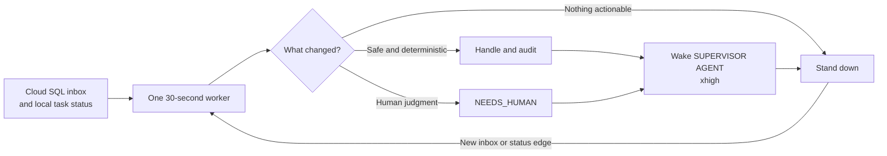
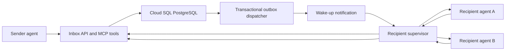

# Multi-principal agent inbox plan



## Status

Proposed architecture. This plan does not authorize or implement live message
delivery. It defines the boundary between a shared agent inbox and the local
supervisor so that later implementation can be split into reviewable specs.

Companion research: [Agent inbox and cross-principal coordination landscape](../docs/agent-inbox-landscape.md).

## Goal

Let an agent acting for one person send a durable asynchronous message to an
agent acting for another person. The recipient's agents may be offline, may run
on another host, and may use a different agent framework. Both people must be
able to determine who sent the message, what authority it carried, which agent
handled it, and whether it was merely received or actually completed.

The first concrete scenario is:

```text
one principal's agent
  -> shared inbox
  -> another principal's supervisor
  -> one of that principal's local agents
  -> shared reply thread
```

## Recommendation

Build the shared inbox as a small independent control-plane service backed by
Cloud SQL for PostgreSQL. Integrate the supervisor through an inbox adapter,
but do not merge the mailbox service into the supervisor and do not move local
supervisor process state into Cloud SQL.

This gives each component one durable responsibility:

| Component | Durable responsibility |
| --- | --- |
| Shared inbox | Principals, agent identities, contact grants, threads, messages, recipient deliveries, shared audit |
| Local supervisor | Local routing, execution claims, provider sessions, adapter evidence, delivery ambiguity, human review |
| Agent runtime | Reasoning and task execution within delegated authority |
| Notification transport | Wake-up hint only; never the source of truth |

## Why the supervisor should be integrated

The supervisor already has the right receiving-side safety concepts:

- stable unread receipts;
- idempotent claims;
- transport acknowledgement separated from observed state clearance;
- terminal human-review markers;
- durable audit state; and
- fail-closed behavior when provenance or delivery is ambiguous.

Those concepts should be reused through a transport-neutral adapter. The
supervisor should not own the shared directory, cross-principal authorization,
or remote message history. Combining those responsibilities would couple local
process lifecycle to network availability and give a host-level controller too
much authority over other principals' identities.

## Architecture



Cloud SQL is authoritative. Pub/Sub, webhooks, or another notification system
may wake a supervisor, but consumers must always read and claim the durable
delivery through the inbox API.

Agents must not connect directly to the database. The API authenticates the
caller, derives its principal and agent identity, applies contact and capability
policy, bounds payloads, and records an append-only audit trail.

## Identity and addressing

Use immutable identifiers internally:

- `principal_id`: accountable person, team, or service;
- `agent_id`: durable logical agent owned by exactly one principal;
- `agent_instance_id`: one running process or installation; and
- `address_id`: revocable human-readable address mapped to an agent or routing
  group.

An address such as `research@alice` is a convenience, not an authorization
identity. Display names and addresses may change; message envelopes retain the
immutable sender and recipient IDs that were resolved at send time.

An agent may not self-assert that it represents a principal. Enrollment binds
the agent to a principal through an authenticated administrative flow. Runtime
credentials are short lived, scoped, revocable, and attributable to one agent
or supervisor installation.

## Contact and authority model

Cross-principal delivery requires a contact grant or an explicit receiving
policy. A grant should constrain at least:

- sender principal or agent;
- recipient address or agent;
- allowed message kinds;
- allowed capabilities or requested action classes;
- attachment and payload limits;
- expiry and revocation; and
- whether unattended execution is allowed.

Receipt is not consent, and consent is not task completion. An imperative
message from another principal enters the recipient's Collector as a capture.
It becomes committed work only after the recipient's policy, supervisor, or
human explicitly accepts it.

## Message model

Every message is immutable and belongs to a thread. Corrections and status
changes are new messages rather than edits to prior evidence.

Recommended message kinds:

- `NOTE`: information with no requested action;
- `QUESTION`: a requested response;
- `TASK_PROPOSAL`: work offered for acceptance, not yet a commitment;
- `TASK_ACCEPTED` or `TASK_DECLINED`;
- `PROGRESS`;
- `RESULT`;
- `CANCEL_REQUEST`;
- `NEEDS_HUMAN`; and
- `SYSTEM_RECEIPT`.

The envelope contains:

- message, thread, sender, and recipient IDs;
- schema version and message kind;
- creation time and optional expiry;
- idempotency key;
- reply-to and causal-parent IDs;
- plain text or structured body;
- attachment references and hashes;
- requested capability and authority context;
- sensitivity and retention labels; and
- trace context.

Do not place arbitrary secrets or large binary attachments in PostgreSQL.
Store bounded message bodies in PostgreSQL and use signed references to object
storage for larger artifacts.

## Delivery and processing states

Keep shared delivery, local processing, and semantic task state separate.

### Shared recipient delivery

```text
QUEUED -> AVAILABLE -> CLAIMED -> RECEIVED
                         |            |
                         v            v
                      EXPIRED      DEAD_LETTERED
```

`RECEIVED` means the recipient supervisor durably accepted the envelope. It
does not mean an agent read, accepted, or completed the request.

### Local processing claim

The supervisor records which local agent instance is handling the delivery,
the lease expiry, attempt number, and final local disposition. This is distinct
from the existing `supervisor_delivery_claims`, which protects an outbound
reply attempt into a Codex task.

Introduce a separate concept such as `inbox_processing_claims`. Never overload
one claim table to mean both inbound work ownership and outbound transport
delivery.

### Semantic response

Acceptance, rejection, progress, completion, cancellation, and escalation are
messages in the thread. They remain visible even after transport records age
out.

## Initial database model

The first schema should contain:

- `principals`
- `agents`
- `agent_instances`
- `addresses`
- `contact_grants`
- `threads`
- `messages`
- `message_recipients`
- `delivery_claims`
- `attachments`
- `audit_events`
- `outbox_events`

Important constraints:

- globally unique immutable IDs;
- unique `(sender_agent_id, idempotency_key)` for sends;
- one recipient row per resolved recipient;
- leases acquired with an atomic conditional update or row lock;
- append-only messages and audit events;
- database-enforced tenant ownership references; and
- explicit retention and deletion state rather than silent hard deletion.

## Inbox API and MCP surface

Start with a small transport-neutral service:

- `resolve_address`
- `describe_agent`
- `send_message`
- `list_deliveries`
- `claim_delivery`
- `acknowledge_receipt`
- `release_or_dead_letter_delivery`
- `reply_to_thread`
- `get_thread`
- `search_inbox`

Administrative enrollment and contact grants should use a separate human-facing
surface rather than tools available to every runtime agent.

All mutation calls require idempotency keys. List and claim operations use
bounded pagination. The API returns structured error categories that distinguish
authentication, authorization, conflict, expiry, validation, and temporary
transport failure.

## Supervisor integration boundary

Add an adapter protocol rather than inbox-specific logic throughout the current
supervisor:

```text
InboundInventory
  scan() -> inbound candidates with stable receipt IDs

InboundContextReader
  read(candidate) -> bounded authenticated envelope and thread context

InboundClaimStore
  claim / renew / complete / escalate

OutboundResponder
  send response -> transport receipt
```

The existing Codex unread scanner remains one implementation. A future shared
inbox adapter becomes another. Generalize `ThreadCandidate` only when the second
adapter is being implemented; avoid a speculative refactor before the inbox API
contract exists.

The supervisor's first inbox mode should be explicit and one-shot, mirroring
the current dry-run posture:

```text
supervisor inbox scan-once
```

It should list eligible deliveries, route them in dry run, and record the
proposed local agent and disposition without claiming or replying. Live claims
and replies require their own canary evidence tied to the exact inbox inventory
and response adapter identities.

## Routing and task-management behavior

Inbound messages enter the Collector. Routing may:

- attach a `NOTE` to reference context;
- route a clear question to a Getter;
- place a `TASK_PROPOSAL` in an open-question or review queue;
- send accepted work to an Updater and appropriate execution agent;
- place uncertain or high-impact requests into human review; or
- ignore or reject unauthorized traffic with an auditable reason.

For any judgment that changes commitment, priority, interruption, escalation,
or external action, record the applied policy or heuristic, the source evidence,
the relevant time boundary, uncertainty, and a disconfirming check. Do not let
another agent's urgency label automatically become the recipient's priority.

## Security and abuse controls

The first version must address:

- spoofed sender identity;
- ambiguous or recycled display names;
- prompt injection in message bodies and attachments;
- confused-deputy requests that exceed delegated authority;
- spam and message amplification loops;
- replayed sends and duplicate processing;
- oversized or malicious attachments;
- cross-tenant search or thread leakage;
- compromised agent credentials;
- agents replying indefinitely to one another; and
- deletion or mutation of audit evidence.

Enforce per-contact rate limits, maximum automatic reply depth, thread budgets,
expiry, revocation, attachment scanning, and a terminal human-review path.
Treat message content as untrusted input. Authentication proves the sender, not
the truth or safety of its instructions.

## Observability

Operators need to distinguish:

- message accepted by the API;
- recipient delivery made available;
- delivery claimed by a supervisor;
- transport receipt acknowledged;
- local agent accepted or declined the proposal;
- result returned;
- human review requested; and
- delivery or processing abandoned.

Use correlation IDs across the shared thread, recipient delivery, local
processing claim, provider session, and response message. Store bounded,
redacted event details rather than raw agent context in operational logs.

## Delivery phases

### Phase 0: contracts and threat model

1. Complete the comparative research document.
2. Define the versioned message envelope and lifecycle state machines.
3. Define principal enrollment, contact grants, and revocation.
4. Write abuse cases and testable security invariants.
5. Decide whether initial interoperability is custom MCP/HTTP or an A2A subset.

Exit: schemas and trust boundaries are reviewable without deployed services.

### Phase 1: local two-principal proof

1. Implement the inbox API against local PostgreSQL or a disposable Cloud SQL
   instance.
2. Register two synthetic principals and one agent address each.
3. Prove send, list, claim, receipt, reply, expiry, duplicate suppression, and
   revocation.
4. Add an append-only audit viewer.
5. Keep all execution synthetic; do not invoke Codex or Claude.

Exit: deterministic tests prove isolation and delivery semantics.

### Phase 2: supervisor dry-run adapter

1. Add the transport-neutral inbound interfaces.
2. Implement the shared-inbox adapter.
3. Add `supervisor inbox scan-once` with no claim or reply path.
4. Record proposed routing and human-review decisions locally.
5. Prove existing Codex supervisor behavior is unchanged.

Exit: real inbox envelopes can be evaluated without mutating shared delivery
state or agent tasks.

### Phase 3: canary-gated local processing

1. Add inbound processing claims with bounded leases.
2. Route only one disposable message to one disposable local agent.
3. Require adapter-bound canary evidence before every live claim or response.
4. Reconcile API receipt, local completion, and reply visibility.
5. Make all ambiguity terminal and visible to human review.

Exit: one message produces at most one live local execution and one idempotent
response.

### Phase 4: cross-host wakeups and operations

1. Add the transactional outbox dispatcher.
2. Add Pub/Sub or webhook wakeups without changing Cloud SQL authority.
3. Add dead-letter inspection, rate limits, quotas, metrics, and alerts.
4. Exercise credential revocation and principal offboarding.
5. Run bounded failure tests for network partitions and crashed supervisors.

Exit: offline recipients, retries, and recovery behave predictably.

### Phase 5: interoperability

1. Add agent discovery metadata.
2. Map supported message kinds to an established protocol where useful.
3. Test a second agent framework and a separately operated recipient.
4. Preserve local contact grants and governance even when the external protocol
   is more permissive.

Exit: two independently implemented agent systems exchange a traceable thread
without sharing database access or internal memory.

## Acceptance criteria

- One principal's agent can address another principal's agent without learning
  its host, database, provider session, or internal tools.
- The sender cannot forge another principal or bypass a contact grant.
- An offline recipient can retrieve the durable message later.
- Duplicate sends and redeliveries do not produce duplicate execution.
- Receipt, acceptance, completion, and human review are visibly distinct.
- Competing recipient agent instances cannot both own the same exclusive claim.
- A message cannot silently become a committed task solely because the sender
  requested urgency.
- The supervisor continues operating locally when the shared inbox is down.
- The shared inbox continues preserving messages when a supervisor is down.
- Ambiguous delivery or provenance stops automation and produces inspectable
  evidence.

## Open decisions

1. Is the first address target a single logical agent, a role-based routing
   group, or both?
2. Must every cross-principal contact grant be human-approved, or may a
   principal publish a constrained public inbox policy?
3. Which message kinds may trigger unattended execution?
4. Is end-to-end payload encryption required, or is service-side encryption
   with strict tenant authorization sufficient initially?
5. What are the default retention, deletion, export, and legal-hold behaviors?
6. Does the first version need federation across separately operated inbox
   services, or only separately operated agent runtimes?
7. Should A2A task objects be the initial wire envelope or a later gateway?

The companion research recommends Phase 0 defaults for these decisions. They
should be resolved in the protocol contract before Phase 1 begins.
