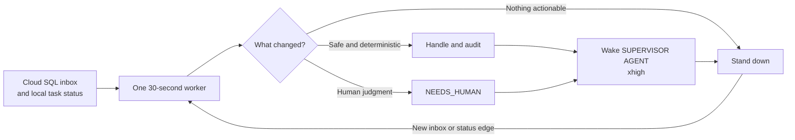

# Supervisor Cloud SQL inbox adapter implementation plan



## Status

Ready for implementation in parallel with
[cloud-sql-agent-inbox-v0.md](https://github.com/FrankLong1/supervisor-agent/issues/5). This track consumes
the stored-function contract defined there and must not invent a conflicting
schema or bypass it with raw table access.

## Objective

Extend the existing `supervisor` program so the same local controller can poll
a shared Cloud SQL inbox, safely claim deliveries addressed to its principal,
route them to local handling, and write replies.

The first iteration proves the adapter and lifecycle without enabling generic
autonomous agent execution:

```text
supervisor inbox scan-once  # read-only routing recommendation
supervisor inbox run-once   # explicit one-delivery synthetic/canary handler
```

Persistent polling and real provider execution follow only after the one-shot
path proves identity, claims, idempotency, and restart behavior.

## Non-goals

- Do not turn the supervisor into the shared mailbox server.
- Do not add Cloud Run, Pub/Sub, SMTP, webhooks, Matrix, A2A, or SLIM.
- Do not grant the supervisor raw mailbox table privileges.
- Do not change or weaken existing Codex unread-task selection, canary, delivery
  claim, or terminal human-review behavior.
- Do not treat an inbound `TASK_PROPOSAL` as an accepted commitment.
- Do not enable an always-on autonomous execution loop in the first checkpoint.
- Do not store Cloud SQL credentials in the repository or local SQLite.

## Ownership boundary

This track owns:

- inbox configuration and connection setup;
- a typed PostgreSQL stored-function client;
- read-only inbox scanning;
- local inbound processing claims and audit state;
- explicit one-shot claim, receipt, disposition, and reply behavior;
- routing policy and human-review integration;
- fakes and integration tests; and
- operator CLI and documentation.

The cloud track owns Terraform, PostgreSQL schema, stored functions, IAM grants,
and database contract tests.

## Preserve the current supervisor model

The repository currently distinguishes:

- an unread Codex task candidate;
- a proposed decision;
- an outbound delivery claim;
- transport acknowledgement;
- observed unread-state clearance; and
- terminal human review.

Keep those concepts intact. Add parallel inbox concepts rather than renaming
the current `supervisor_delivery_claims` table or generalizing it prematurely.

The existing foreground provider controller also remains independent from
inbox polling. An operator can run a provider without enabling inbox work.

## Proposed package structure

Use a focused module boundary:

```text
src/codex_supervisor/inbox/
  __init__.py
  models.py
  protocol.py
  postgres.py
  routing.py
  service.py
```

Exact filenames may follow repository style, but keep the database adapter out
of the Codex app-server adapter and keep routing policy out of SQL code.

## Configuration

Add an explicit inbox configuration source with environment variables or CLI
arguments for:

```text
SUPERVISOR_INBOX_DSN
SUPERVISOR_INBOX_INSTANCE_ID
SUPERVISOR_INBOX_POLL_SECONDS
SUPERVISOR_INBOX_CLAIM_SECONDS
SUPERVISOR_INBOX_AGENT_ADDRESS or agent UUID
SUPERVISOR_INBOX_MODE=disabled|dry-run|one-shot|poll
```

Prefer a DSN pointed at a local Cloud SQL Auth Proxy socket or port for v0.
Support an official Cloud SQL Python connector only if it does not complicate
local tests or require credentials beyond Application Default Credentials.

Configuration requirements:

- inbox mode defaults to `disabled`;
- instance ID is stable across process restarts on one installation;
- poll and lease durations have bounded safe ranges;
- secrets and access tokens are never written to heartbeat or SQLite state;
- status output may expose masked connection target and adapter identity, not
  credentials; and
- missing or malformed configuration fails closed before a claim.

## Typed shared contract

### Models

Add immutable models for:

```text
InboxEnvelope
  message_id
  delivery_id
  thread_id
  reply_to_message_id
  sender_principal_id
  sender_agent_id
  sender_address/display metadata
  recipient_agent_id
  kind
  subject
  body_text
  body_json
  created_at
  expires_at

InboxClaim
  envelope
  claimant_instance_id
  claimed_at
  claim_until

InboxDisposition
  outcome: RECEIVED_ONLY | COMPLETED | DECLINED | NEEDS_HUMAN | NOT_UNDERSTOOD
  reason
  reply_kind optional
  reply_subject optional
  reply_body_text optional
  reply_body_json optional
  reply_idempotency_key optional
```

Parse database rows strictly. Unknown required fields, invalid UUIDs, invalid
timestamps, unsupported kinds, or oversized payloads produce a bounded
validation error and no claim in dry-run mode. After a live claim, such errors
route to `NOT_UNDERSTOOD` or `NEEDS_HUMAN` according to a deterministic policy.

### Adapter protocol

Define a protocol usable by both PostgreSQL and test fakes:

```text
list_deliveries(limit, status) -> tuple[InboxEnvelope, ...]
claim_next(instance_id, lease_seconds, recipient_agent_id?) -> InboxClaim | None
mark_received(delivery_id, instance_id) -> bool
complete(delivery_id, instance_id, outcome, detail) -> bool
send_message(...) -> SendReceipt
```

The PostgreSQL implementation calls only:

```text
inbox_list_deliveries
inbox_claim_next_delivery
inbox_mark_received
inbox_complete_delivery
inbox_send_message
```

It never issues raw DML against mailbox tables.

## Local state additions

Add new SQLite tables without changing existing delivery tables.

### `supervisor_inbox_observations`

Records read-only scans and routing recommendations:

```text
id integer primary key
delivery_id text not null
message_id text not null
thread_id text not null
kind text not null
proposed_route text not null
proposed_disposition text not null
reason text not null
observed_at text not null
unique(delivery_id, observed_at) or another bounded audit key
```

Do not store full message bodies in local audit state. Store IDs, bounded title
metadata, policy result, and reason.

### `supervisor_inbox_processing`

Correlates a shared delivery claim with local handling:

```text
delivery_id text primary key
message_id text not null
thread_id text not null
claimant_instance_id text not null
shared_claim_until text not null
local_status text not null
handler_kind text not null
reply_message_id text null
last_error text null
created_at text not null
updated_at text not null
```

Initial local statuses:

```text
CLAIMED
RECEIVED
HANDLED
REPLIED
NEEDS_HUMAN
AMBIGUOUS
```

This table is a local execution ledger. Shared delivery state remains in Cloud
SQL. Reconciliation compares both before deciding whether a retry is safe.

### `supervisor_inbox_canary_evidence`

Record successful disposable end-to-end evidence bound to:

- database contract version;
- PostgreSQL adapter identity/version;
- authenticated principal identity;
- local handler identity/version; and
- evidence creation and revocation times.

Do not reuse Codex reply canary evidence because the transport and invariants
are different.

## Routing policy

Implement a deterministic first-pass router before using an LLM:

| Message kind | Default route |
| --- | --- |
| `NOTE` | Record as reference; no reply unless requested by policy |
| `QUESTION` | Eligible for bounded synthetic/canary response; real Getter later |
| `TASK_PROPOSAL` | Open question or human review; never auto-accept by default |
| `PROGRESS` | Attach to existing local correlation if known; otherwise reference |
| `RESULT` | Mark as received and surface to the relevant local task or operator |
| `NEEDS_HUMAN` | Terminal human-review queue |
| Unknown kind | `NOT_UNDERSTOOD` without executing content |

Routing considers contact-grant metadata returned by the database, especially
whether unattended execution is permitted. Sender-supplied urgency or prose
cannot override recipient policy.

Treat all message bodies and JSON as untrusted. The router must not interpolate
body text into shell commands, SQL, system prompts, or tool permissions.

## CLI behavior

### `supervisor inbox status`

Shows:

- configured/disabled state;
- masked database target;
- adapter identity and contract version;
- local instance ID;
- last successful poll;
- counts of observations, active processing, ambiguity, and human review; and
- whether matching inbox canary evidence exists.

It must not connect merely to render local status unless `--check-connection`
is explicitly provided.

### `supervisor inbox scan-once`

Read-only behavior:

1. Connect and call `inbox_list_deliveries`.
2. Parse bounded envelopes.
3. Apply deterministic routing policy.
4. Record redacted observations locally.
5. Print a structured summary.

It never claims, acknowledges, completes, replies, or changes human-review
state in Cloud SQL.

### `supervisor inbox canary`

Explicit disposable proof:

1. Require a known synthetic delivery ID or recipient test address.
2. Claim exactly one eligible canary message.
3. Persist the local processing row before further mutation.
4. Mark the shared delivery received.
5. Generate a deterministic non-LLM response such as a bounded echo receipt.
6. Send the response with a stable idempotency key derived from delivery ID and
   handler version.
7. Complete the shared delivery.
8. Read back the thread or reply through the sender-side smoke harness.
9. Record adapter-bound canary evidence only after every observation succeeds.

Any ambiguous send or lost connection after a mutation records `AMBIGUOUS`,
creates human review, and does not retry automatically.

### `supervisor inbox run-once`

Requires matching inbox canary evidence immediately before the claim. Claims at
most one message, applies only the enabled deterministic handler set, writes an
idempotent reply if applicable, and exits. Generic provider execution remains
disabled until a later reviewed iteration.

### Later: `supervisor inbox poll`

Only after one-shot recovery tests pass:

- poll at a bounded interval with jitter;
- process at most one or a small configured batch per tick;
- renew no claim indefinitely;
- stop cleanly on signal;
- remain healthy when Cloud SQL is temporarily unavailable;
- expose heartbeat data without credentials or bodies; and
- never restart an ambiguous local processing row automatically.

## Claim and failure algorithm

For a live one-shot delivery:

1. Verify matching inbox canary evidence.
2. Call the atomic shared claim function.
3. Write the local `CLAIMED` row and commit SQLite.
4. Mark the shared delivery `RECEIVED`.
5. Update local status to `RECEIVED`.
6. Run the bounded handler.
7. Persist the proposed disposition and deterministic reply idempotency key
   locally before sending.
8. Send the reply through `inbox_send_message`.
9. Persist returned reply ID locally.
10. Complete the shared delivery.
11. Mark the local row terminal.

On restart:

- local `CLAIMED` with an active shared claim is human-reviewable and not
  blindly reclaimed;
- local proposed reply without a known reply ID is reconciled by idempotency
  key before any retry;
- a returned reply ID plus incomplete shared delivery may safely retry only the
  idempotent completion call;
- expired shared claims with no local side effect may be released by the
  database maintenance path; and
- any contradictory shared/local terminal state becomes `AMBIGUOUS`.

## Testing strategy

### Unit tests with a fake adapter

- `scan-once` lists and routes without mutation.
- Every supported kind receives the documented default route.
- `TASK_PROPOSAL` never becomes accepted work by default.
- Unknown or malformed envelopes do not execute content.
- One-shot processing writes local claim state before shared acknowledgement.
- Deterministic reply idempotency keys survive restart.
- Ambiguous send, acknowledgement, and completion paths stop without duplicate
  execution.
- Existing Codex supervisor tests remain unchanged and green.
- Status output redacts DSNs, tokens, full message bodies, and provider session
  IDs.

### PostgreSQL integration tests

Run against the cloud track's local migration:

- list is non-mutating;
- claim is exclusive across two adapter instances;
- mark-received and completion enforce instance ownership;
- connection loss after reply can be reconciled by idempotency key;
- claim expiry plus local state produces the documented recovery result; and
- the adapter cannot issue raw DML with its runtime role.

### End-to-end canary

Use two synthetic principals and separate authenticated connections:

1. Sender inserts a `QUESTION`.
2. Recipient `scan-once` observes it without mutation.
3. Recipient runs the explicit canary.
4. Sender observes exactly one `RESULT` in the same thread.
5. Recipient and sender status agree on receipt and completion.
6. Re-running every command produces no duplicate response or execution.

## Implementation sequence

1. Add models, adapter protocol, and fake implementation.
2. Add inbox configuration with disabled default.
3. Add local SQLite migrations and repository methods.
4. Add deterministic routing and `status` plus `scan-once`.
5. Add PostgreSQL stored-function client.
6. Run against local PostgreSQL contract fixtures.
7. Add explicit synthetic canary command and failure reconciliation.
8. Add `run-once` restricted to deterministic handlers.
9. Run the cross-identity Cloud SQL canary when the cloud track is ready.
10. Update operator documentation and preserve the later nature of persistent
    polling and provider execution.

## Acceptance criteria

- Inbox mode is disabled by default and does not affect `supervisor codex`,
  `supervisor claude`, or current `scan-once` behavior.
- The same supervisor package can read shared inbox deliveries through stored
  functions without raw table access.
- Read-only scanning is provably non-mutating.
- One live canary delivery is claimed and handled at most once.
- A deterministic reply is idempotent across process restart and connection
  loss.
- `TASK_PROPOSAL` remains uncommitted without recipient acceptance policy.
- Shared delivery state and local processing state are distinguishable and
  reconcilable.
- Ambiguity becomes terminal human review rather than automatic retry.
- Existing tests and new fake/PostgreSQL integration tests pass.
- No always-on loop or generic LLM execution is required for the first merged
  checkpoint.

## Stop conditions

Stop and report rather than weakening the boundary when:

- the database contract differs from the cloud plan and cannot be reconciled
  without changing both plans;
- the runtime identity cannot be attributed to exactly one principal;
- a stored function requires raw table privilege to operate;
- a reply outcome cannot be reconciled after a transport error;
- existing Codex delivery safety tests regress; or
- enabling inbox mode implicitly enables a provider, reply loop, or external
  action not selected by the operator.
