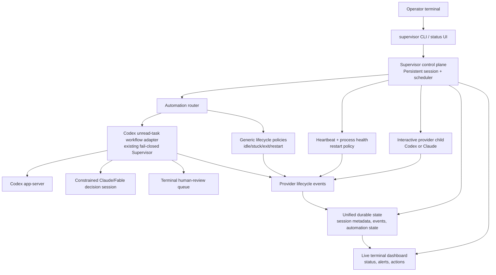
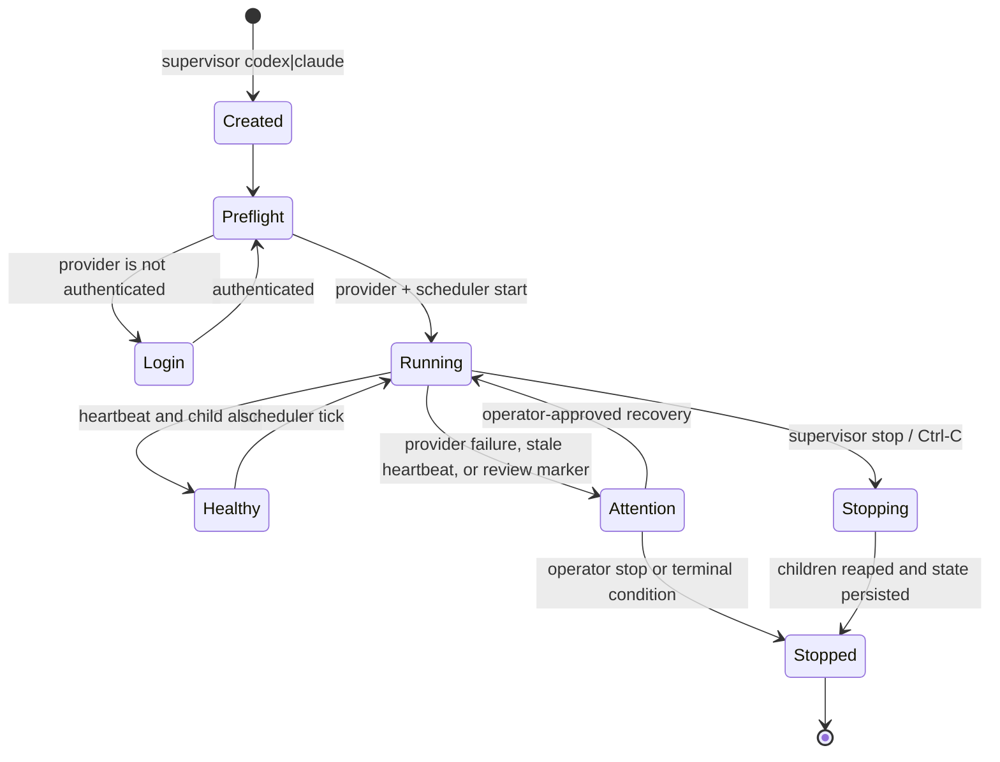

# Unified Supervisor Control Plane — Handoff Plan

## Correct product definition

`supervisor` is not merely a CLI launcher. It is the operator-facing control
plane for agent work on this machine. Starting `supervisor codex` or
`supervisor claude` must create a durable managed session that owns:

- the provider process;
- the recurring manager/scheduler loop;
- health and heartbeat reporting;
- stop/restart/recovery decisions;
- a single terminal status UI;
- durable lifecycle and automation state.

The existing `codex-unread-supervisor` is not disposable: it contains the
fail-closed Codex unread-task workflow, canary gating, delivery claims, and
human-review invariants. The unified control plane must run it through a
well-defined adapter, not copy its logic or bypass its safety gates.

## Target architecture



## Operational model



## Command contract

```text
supervisor codex [--task TEXT] [--automation off|shadow|live]
supervisor claude [--task TEXT] [--automation off|shadow]
supervisor status [--watch] [--json]
supervisor stop [SESSION_ID] [--force]
supervisor restart [SESSION_ID]
supervisor logs [SESSION_ID] [--follow]
supervisor doctor
```

Defaults:

- `supervisor codex` starts the interactive Codex child and the generic
  scheduler in `shadow` mode. It also defaults Codex to `gpt-5.6-sol` with
  `ultra` reasoning.
- `supervisor claude` starts the interactive Claude child and the generic
  scheduler in `shadow` mode.
- `--automation live` is available only for the existing Codex unread-task
  adapter and must preserve its existing canary-evidence gate. It is never a
  default and is not available for Claude until a similarly safe Claude task
  adapter exists.
- `status` is the primary UI. It shows provider activity, scheduler cadence,
  last tick outcome, health, pending human-review markers, and explicit actions
  an operator can take.

## What the next agent should implement

### 1. Replace the launcher-only loop with a controller runtime

Current files `src/codex_supervisor/manager.py` and `manager_cli.py` persist a
provider child and support `status`/`stop`; extend them with a `ManagedRuntime`
that owns the child process and a periodic scheduler task.

Required behavior:

- write a heartbeat before and after every scheduler tick;
- record structured events and last-success/last-failure timestamps;
- handle `SIGINT` and `SIGTERM` by stopping the scheduler first, then the
  provider process group, then persisting final state;
- treat stale state, process identity mismatch, and unexpected exit as
  `attention` rather than silently restarting a provider;
- make automatic restart an explicit, bounded policy with recorded reasons.

### 2. Introduce an automation adapter boundary

Create a protocol such as:

```python
class AutomationAdapter(Protocol):
    name: str
    def tick(self, session: ManagedSession) -> AutomationOutcome: ...
    def readiness(self, session: ManagedSession) -> ReadinessReport: ...
    def stop(self, session: ManagedSession) -> None: ...
```

Provide two initial adapters:

1. `LifecycleAdapter` — generic, provider-agnostic process/heartbeat checks.
2. `CodexUnreadTaskAdapter` — delegates to the current `Supervisor.run_once()`
   path and uses its existing `SupervisorState`, canary records, delivery
   claims, and terminal human-review behavior.

Do not move or reimplement unread-task scanner, delivery, or canary logic in
the manager module. The adapter invokes it and translates its outcome into a
dashboard event.

### 3. Define automation modes explicitly

Use a typed mode, not booleans:

```text
off     provider session only; no periodic automation
shadow  ticks run but cannot send task replies or mutate delivery state
live    Codex adapter only; requires current canary evidence and explicit flag
```

The existing unattended workflow's semantics must win whenever it is enabled:
uncertain context, classifier failure, ambiguous delivery, or an uncleared
claim becomes human review. The new controller must never retry around those
terminal outcomes.

### 4. Upgrade status into the single operator UI

Keep the existing browser console as an optional detailed human-review view,
but make `supervisor status` show the immediate operational picture:

```text
Session:        <id>  codex  running
Provider:       gpt-5.6-sol / ultra
Scheduler:      shadow, every 30s; last tick 4s ago: ok
Health:         healthy
Automation:     2 candidates scanned; 0 delivery attempts
Review queue:   1 task needs human review
Actions:        supervisor logs <id> | supervisor stop <id>
```

`--json` must expose the same data for a future web UI or systemd integration.

### 5. Make image installation start the correct entry point

Retain `scripts/install-supervisor.sh`, but update it after the runtime exists
to install:

- the `supervisor` command;
- idempotent Zsh PATH/alias configuration;
- optional disabled-by-default systemd user unit for a named managed session.

Do **not** enable the automation service implicitly in image installation.
The image should make the control plane available; an operator explicitly
starts a session or enables a reviewed unit.

## Test plan and acceptance criteria

1. Unit-test scheduler ticks, heartbeat transitions, graceful stop ordering,
   stale-process detection, and bounded restart policy using fake providers.
2. Unit-test that `shadow` mode cannot call the Codex delivery method.
3. Regression-test all existing unread-task safety invariants unchanged.
4. Integration-test `supervisor codex --automation shadow` with a fake Codex
   provider and fake app-server inventory; `status --json` must report tick
   outcomes and human-review count.
5. Prove `--automation live` is rejected without valid existing canary evidence.
6. Manually test on the remote machine: provider login, terminal dashboard,
   Ctrl-C, `supervisor stop`, and log/state preservation.

## Non-goals for this implementation step

- No automatic task reply outside the established Codex canary gate.
- No generic claim that Claude can operate the Codex unread-task workflow.
- No hidden cron entry or silently enabled systemd service.
- No autonomous retry of terminal human-review outcomes.
