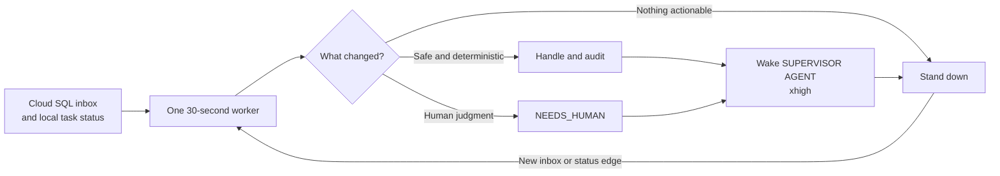

# Unified Supervisor Control Plane

This plan has been split into implementable specs. The old all-at-once handoff
mixed immediate safety cleanup with live delivery, restart policy, terminal
multiplexing, services, and dashboard work. Git history retains that document
if its architectural discussion is needed.

## Implement now

1. [Cleanup, unread detection, and one-shot dry run](../specs/01-cleanup-unread-dry-run.md)
2. [Simple controller](../specs/02-simple-controller.md)

The first checkpoint manages one foreground provider process, detects only
genuinely unread Codex tasks only when `scan-once` is invoked, and records
recommendations without any automatic reply path.

## Implement later

The remaining path is ordered and intentionally incremental:

1. [Authoritative unread feed](../specs/03-authoritative-unread-feed.md)
2. [Disposable canary](../specs/04-disposable-canary.md)
3. [Explicit continue-once](../specs/05-explicit-continue-once.md)
4. [Foreground unattended worker](../specs/06-unattended-worker.md)
5. [Crash recovery and restart](../specs/07-recovery-and-restart.md)
6. [Background user service](../specs/08-background-service.md)
7. [Detached interactive sessions](../specs/09-detached-interactive-sessions.md)
8. [Operator UI and alerts](../specs/10-operator-ui-and-alerts.md)

See the [specs index](../specs/README.md) for vocabulary, order, and the first
shipping command contract.
